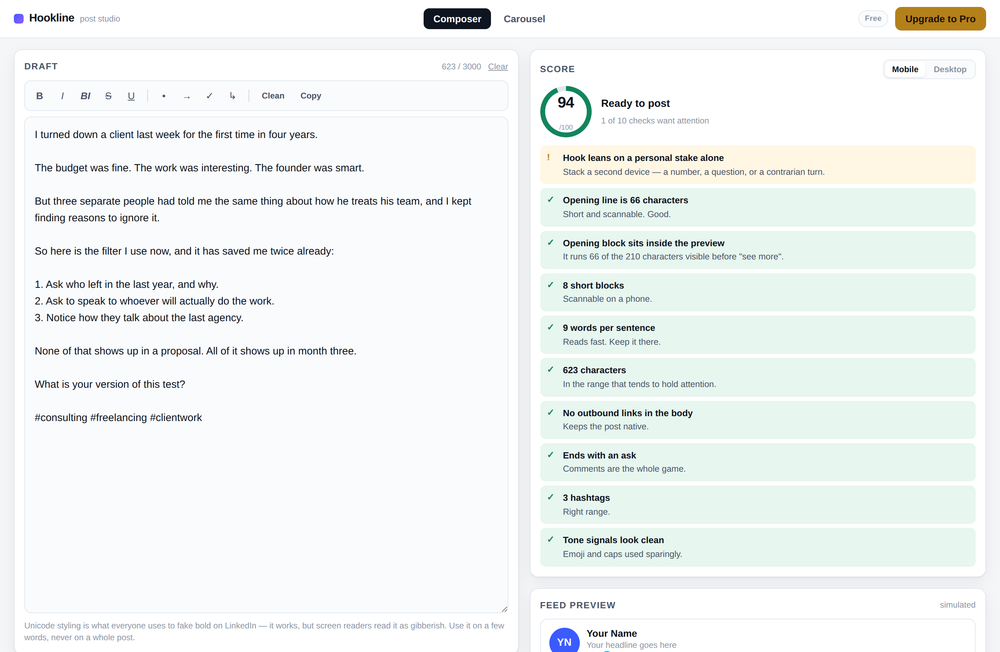
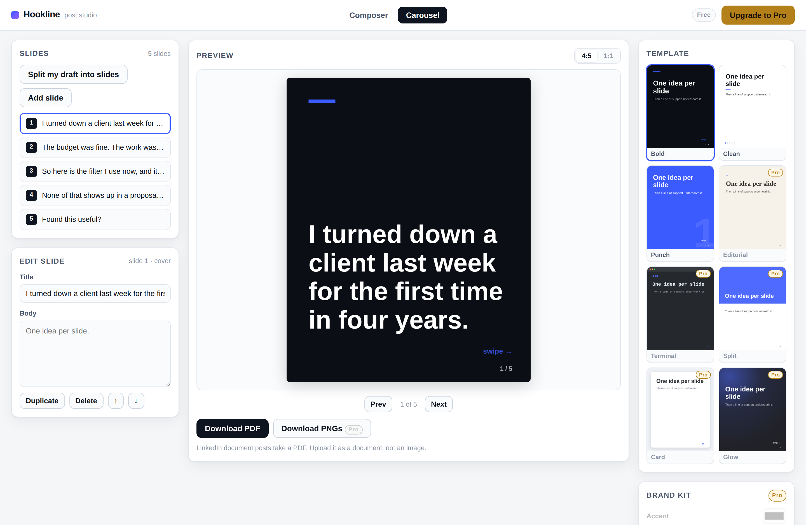

# Hookline

**A post studio for the people who actually post.** Write the draft, see the
score, watch the "see more" cut land, then turn the same text into a carousel
PDF you can upload as a document post.

No signup. No upload. **No network requests at all** — no CDN, no webfonts, no
analytics. Open `index.html` and it works, including on a plane.





---

## Why this shape

The people who post weekly on LinkedIn have two jobs and one of them is boring:

1. **Get the first 210 characters right.** That is all anyone sees before
   "see more". Everything else is downstream of that line.
2. **Turn a good post into a carousel.** Document posts pull more dwell time
   than plain text, and every tool that makes them wants $29/month.

Hookline does the first one for free, forever, because it is the thing you do
three times a week and it is what makes the tool a habit. It charges for the
second one at the point where it stops being a one-off and starts being a
brand — your colours, your logo, your face, decks longer than eight slides.

## Free vs Pro

| | Free | Pro (£9/mo) |
|---|---|---|
| Posts, scoring, formatting | Unlimited | Unlimited |
| Feed preview + fold cutoff | ✅ | ✅ |
| Unicode bold / italic toolbar | ✅ | ✅ |
| Carousel slides | up to 8 | unlimited |
| Templates | 3 | 8 |
| Export | PDF, watermarked last slide | PDF + PNG, no watermark |
| Brand kit (colours, type, logo, handle) | — | ✅ |
| Hook rewrites | — | 6 frames per draft |
| Saved drafts and decks | 1 | unlimited |

The gate is deliberately *behind the value*, not in front of it: you can write,
score, format, split into slides and export a real PDF without ever seeing a
paywall. Pro is what you buy once posting is a habit and the deck needs to look
like it came from you rather than from a tool.

## Run it

```bash
git clone <this repo> && cd hookline
python3 -m http.server 8000      # or: npx serve .
open http://localhost:8000
```

There is no build step and no dependency to install. To host it, push to GitHub
and turn on Pages (Settings → Pages → deploy from branch) — it is static files.

## Tests

```bash
npx serve . -l 8137
node test/regression.js
```

Twenty browser checks over the free/pro boundary, the slide cap, PDF export,
brand-kit rendering, persistence and the Unicode round-trip.

## How it works

```
index.html            markup + the pricing modal
assets/app.css        one stylesheet, light and dark
assets/app.js         wiring: tabs, plan gating, state, persistence
assets/composer.js    Unicode styling, the ten scoring checks, hook rewrites
assets/carousel.js    slide model, 8 canvas templates, auto-split from a post
assets/pdf.js         a ~100-line PDF writer
assets/store.js       localStorage + plan state
```

Three decisions worth knowing about:

**Slides are drawn on a canvas, not screenshotted from the DOM.** A template is
just a `draw(ctx, S)` function, so the on-screen preview, the PDF and the PNGs
all come from one code path and the type stays crisp at 1080px.

**The PDF writer is ours.** All we need is N pages, each one full-bleed JPEG,
which is a page tree and a DCTDecode image XObject — about a hundred lines.
A general PDF library is ~350KB from a CDN, and dropping it is what lets the
app claim zero network requests honestly.

**The score never phones home.** Ten weighted checks (hook length, fold,
pattern, whitespace, readability, length, links, closing ask, hashtags, tone)
run on every keystroke in the browser. Every failing check has to name a fix —
a number without an instruction is decoration.

## Wiring up billing

Billing is not connected in this build. "Start 7-day preview" unlocks Pro in
`localStorage` so the tier is evaluable. Two places to change:

- `assets/store.js` → `isPro()` is the single source of truth. Point it at your
  billing provider's entitlement check (or a signed claim in a cookie/JWT).
- `assets/app.js` → the `#startPro` handler is where checkout goes.

Everything else already asks `Store.isPro()`, so those two edits switch the
whole app over. Gating lives in three visible places — `[data-pro-feature]`
elements get `.is-locked`, templates flagged `pro: true` in
`carousel.js`, and `Store.LIMITS.freeSlides`.

## Things it deliberately does not do

- **No AI writing.** The hook rewrites are structural transforms that keep your
  words and your capitalisation. A tool that writes the post for you produces
  posts that read like they were written by a tool.
- **No auto-posting or scheduling.** That needs an API partnership and an
  account, which means an upload, which breaks the promise on the tin.
- **No engagement pods, no comment bots.** Not building that.

## A note on Unicode "bold"

LinkedIn strips rich text, so every bold post you have seen is really
Mathematical Alphanumeric Symbols. The toolbar does it because everyone does
it — and warns you in the UI that screen readers read it as gibberish. Use it
on a few words, never on a whole post.

---

Not affiliated with LinkedIn.
